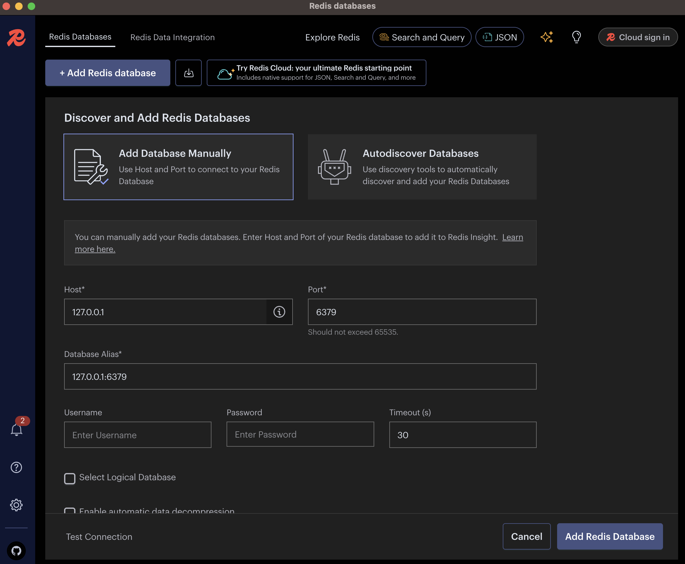
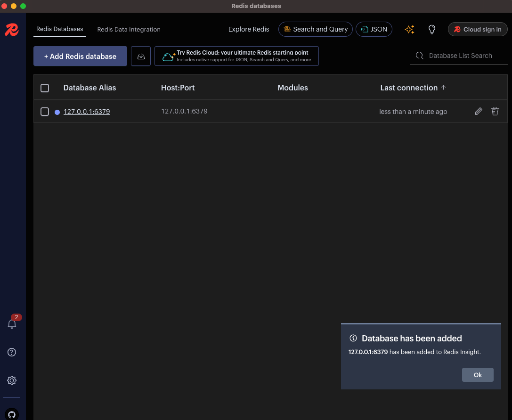
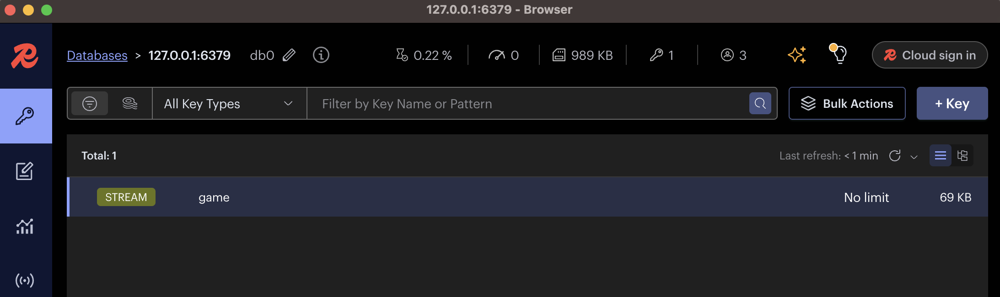
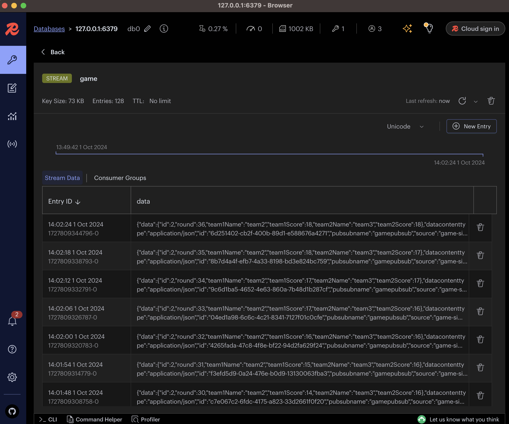

# How to Check the Redis Message Broker While Running the Game Simulator

1. Install [Redis Insight](https://redis.io/insight/). 
- Redis Insight is a GUI tool for visualizing data stored in Redis, whether it's in a database context or a message 
queue. For our use case, we will use redis for both a database and as a message broker.
2. Add Your Redis Instance in Redis Insight
- Open Redis Insight and click `Add Redis database`. Configure the connection with the following settings:

Note: You're connecting to Redis to inspect the published messages for this scenario
3. Verify a Successful Connection
- You will see a popup mentioning that the database was successfully added:

4. Explore the Redis Stream
- In the Redis Insight, simply click the Redis Alias `127.0.0.1:6379`. You will see available streams which Redis uses
to handle message queues and pub/sub data:

5. View Game Data
- Select the `stream` where your volleyball game data is being published. In this case, you should see data associated 
with the `game` topic that the Game Simulator is publishing to.

