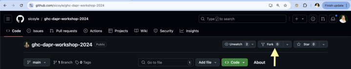
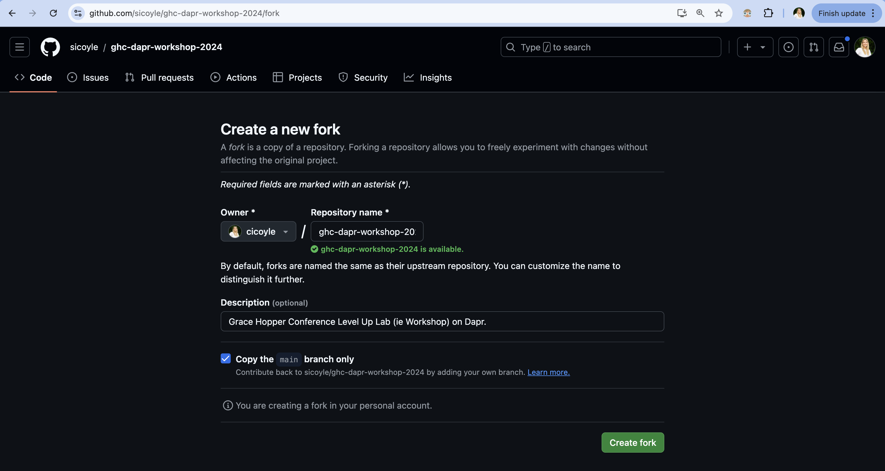
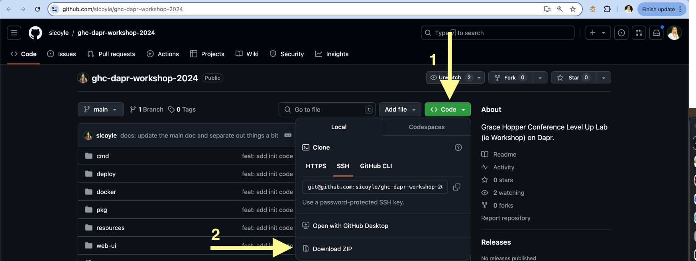

# Prerequisites

- [Install necessary software](#install-necessary-software)
- [Download the code](#download-the-code)
- [Initialize Dapr](#initialize-dapr)
- [Run the code](#run-the-code)

## Install necessary software
1. [Install the Dapr Command Line Interface (CLI)](https://docs.dapr.io/getting-started/install-dapr-cli/)
2. [Download Go](https://go.dev/doc/install)
3. [Install Docker](https://docs.docker.com/engine/install/)
4. Optional to use the User Interface: [Install node & npm](https://docs.npmjs.com/downloading-and-installing-node-js-and-npm)
5. Optional to [install an IDE, such as VSCode](https://code.visualstudio.com/download)


## Download the code

There are many ways to download the code to interact with this Level Up Lab.
Use either flow that applies to you:
- [You have a preexisting Github account](#if-you-have-a-github-account)
- [You do not have a Github account](#if-you-do-not-have-a-github-account)

### If you have a Github account
1. Fork the repository using the button here on the Github UI:


2. Create your fork using the following information where `cicoyle` is replaced by your Github ID.


3. Download the Level Up Lab code locally from your fork:
```
git clone git@github.com:<your Github ID>/ghc-dapr-workshop-2024.git
```
4. Enter the directory where the code is located either in your Finder app, or IDE, or in terminal with:
```
cd ghc-dapr-workshop-2024.git
```

### If you do NOT have a Github account

1. Access the code by downloading a ZIP file containing the Github repository if you do not have a Github account.


2. Unzip the download.

2. Enter the directory where the code is located either in your Finder app, or IDE, or in terminal with:
```
cd ghc-dapr-workshop-2024
```

## Initialize Dapr

[Initialize Dapr in your local development environment](https://docs.dapr.io/getting-started/install-dapr-selfhost/)

```
dapr init
```

## Run the code
At this time, you can [run the code by following the next set of instruction](./runningTheCode.md).