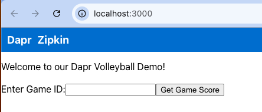
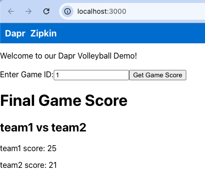

# How to run the code

## Initialize Dapr

[Initialize Dapr in your local development environment](https://docs.dapr.io/getting-started/install-dapr-selfhost/)

```shell
dapr init
```

Note, a `dapr init` includes:
- Running a Redis container instance to be used as a local state store and message broker.
- Running a Zipkin container instance for observability.
- Creating a default components folder with component definitions for the above.
- Running a Dapr placement service container instance for local actor support.
- Running a Dapr scheduler service container instance for job scheduling.

Ensure dapr was successfully installed by seeing this output:

```shell
dapr init           
⌛  Making the jump to hyperspace...
ℹ️  Container images will be pulled from Docker Hub
ℹ️  Installing runtime version 1.14.4
↖  Downloading binaries and setting up components...
Dapr runtime installed to /Users/cassie/.dapr/bin, you may run the following to add it to your path if you want to run daprd directly:
    export PATH=$PATH:/Users/cassie/.dapr/bin
✅  Downloading binaries and setting up components...
✅  Downloaded binaries and completed components set up.
ℹ️  daprd binary has been installed to /Users/cassie/.dapr/bin.
ℹ️  dapr_placement container is running.
ℹ️  dapr_redis container is running.
ℹ️  dapr_zipkin container is running.
ℹ️  dapr_scheduler container is running.
ℹ️  Use `docker ps` to check running containers.
✅  Success! Dapr is up and running. To get started, go here: https://docs.dapr.io/getting-started
```

With dapr successfully installed, check in the Dockerhub UI to see the following running containers:
- dapr_scheduler
- dapr_placement
- dapr_redis
- dapr_zipkin
  

Use the following command to see the containers running via the terminal:

```shell
docker ps -a
CONTAINER ID   IMAGE                           COMMAND                  CREATED         STATUS                   PORTS                                                                                                 NAMES
db750d86480e   daprio/dapr:1.14.4              "./scheduler --etcd-…"   2 minutes ago   Up 2 minutes             0.0.0.0:50006->50006/tcp, 0.0.0.0:52379->2379/tcp, 0.0.0.0:58081->8080/tcp, 0.0.0.0:59091->9090/tcp   dapr_scheduler
3905d0dd21f8   daprio/dapr:1.14.4              "./placement"            2 minutes ago   Up 2 minutes             0.0.0.0:50005->50005/tcp, 0.0.0.0:58080->8080/tcp, 0.0.0.0:59090->9090/tcp                            dapr_placement
49db629fa223   redis:6                         "docker-entrypoint.s…"   2 minutes ago   Up 2 minutes             0.0.0.0:6379->6379/tcp                                                                                dapr_redis
95f598b3b9cb   openzipkin/zipkin               "start-zipkin"           2 minutes ago   Up 2 minutes (healthy)   9410/tcp, 0.0.0.0:9411->9411/tcp                                                                      dapr_zipkin
```

## Dapr Volleyball Services 

### Volleyball Game Simulator

Volleyball Game Simulator simulates a volleyball game scenario where there are 100 volleyball games.
It randomly adds a point to one of two teams during the game until one team wins by 2.
Game point in volleyball is set to 25, but there is no cap in our simulation.
As the game continues, it sends score updates onto the `game` topic of the `gamepubsub` pubsub.

```
cd cmd/game-sim \

dapr run \
--app-id game-sim \
--app-protocol http \
--dapr-http-port 3500 \
--resources-path ../../resources -- go run .
```

No app port
Dapr port: 3500

To verify the command ran successfully, you'll see something similar to the following:

```shell
dapr run \
--app-id game-sim \
--app-protocol http \
--dapr-http-port 3500 \
--resources-path ../../resources -- go run .
ℹ️  Starting Dapr with id game-sim. HTTP Port: 3500. gRPC Port: 53853
ℹ️  Checking if Dapr sidecar is listening on HTTP port 3500
Flag --dapr-http-max-request-size has been deprecated, use '--max-body-size 4Mi'
Flag --dapr-http-read-buffer-size has been deprecated, use '--read-buffer-size 4Ki'
INFO[0000] Starting Dapr Runtime -- version 1.14.4 -- commit 583960dc90120616124b60ad2b7820fc0b3edf44  app_id=game-sim instance=Cassandras-MacBook-Pro.local scope=dapr.runtime type=log ver=1.14.4
...
INFO[0000] Scheduler stream connected                    app_id=game-sim instance=Cassandras-MacBook-Pro.local scope=dapr.runtime.scheduler type=log ver=1.14.4
INFO[0000] Placement tables updated, version: 0          app_id=game-sim instance=Cassandras-MacBook-Pro.local scope=dapr.runtime.actors.placement type=log ver=1.14.4
ℹ️  Checking if Dapr sidecar is listening on GRPC port 53853
ℹ️  Dapr sidecar is up and running.
ℹ️  Updating metadata for appPID: 6961
ℹ️  Updating metadata for app command: go run .
✅  You're up and running! Both Dapr and your app logs will appear here.

== APP == dapr client initializing for: 127.0.0.1:53853
== APP == [2024-10-01 13:49:42] Published data: types.Game{ID:0, Round:1, Team1Name:"team0", Team2Name:"team1", Team1Score:0, Team2Score:1}
== APP == [2024-10-01 13:49:48] Published data: types.Game{ID:0, Round:2, Team1Name:"team0", Team2Name:"team1", Team1Score:0, Team2Score:2}
== APP == [2024-10-01 13:49:54] Published data: types.Game{ID:0, Round:3, Team1Name:"team0", Team2Name:"team1", Team1Score:0, Team2Score:3}
== APP == [2024-10-01 13:50:00] Published data: types.Game{ID:0, Round:4, Team1Name:"team0", Team2Name:"team1", Team1Score:1, Team2Score:3}
...
```

This means the dapr enabled app, with the app-id of `game-sim` is running successfully and publishing data to our message broker, redis.

Optionally: [See inside the Redis message broker by following these steps](./checkRedis.md#how-to-check-the-redis-message-broker-while-running-the-game-simulator)

### Scoreboard API

Scoreboard API Service is a Dapr service that saves volleyball game state,
and provides an API to retrieve game scores using Dapr topic event and service invocation handlers.
It listens to incoming game score update events on the `gamepubsub` pubsub `game` topic,
and any game score that is game point (25) or higher it will save to the state store.
Specific game score may be found using this API when provided a game ID.

```
cd cmd/scoreboard \

dapr run \
  --app-port 3001 \
  --app-id scoreboard \
  --app-protocol http \
  --dapr-http-port 3501 \
  --resources-path=../../resources -- go run .
```

App port 3001
Dapr port: 3501

To verify the command ran successfully, you'll see something similar to the following:

```shell
dapr run \
  --app-port 3001 \
  --app-id scoreboard \
  --app-protocol http \
  --dapr-http-port 3501 \
  --resources-path=../../resources -- go run .
ℹ️  Starting Dapr with id scoreboard. HTTP Port: 3501. gRPC Port: 59149
Flag --dapr-http-max-request-size has been deprecated, use '--max-body-size 4Mi'
Flag --dapr-http-read-buffer-size has been deprecated, use '--read-buffer-size 4Ki'
INFO[0000] Starting Dapr Runtime -- version 1.14.4 -- commit 583960dc90120616124b60ad2b7820fc0b3edf44  app_id=scoreboard
...
INFO[0000] application protocol: http. waiting on port 3001.  This will block until the app is listening on that port.  app_id=scoreboard instance=Cassandras-MacBook-Pro.local scope=dapr.runtime type=log ver=1.14.4
ℹ️  Updating metadata for appPID: 16501
ℹ️  Updating metadata for app command: go run .
✅  You're up and running! Both Dapr and your app logs will appear here.

== APP == 2024/10/01 18:39:23 starting scoreboard service
INFO[0006] application discovered on port 3001           app_id=scoreboard instance=Cassandras-MacBook-Pro.local scope=dapr.runtime type=log ver=1.14.4
INFO[0006] Application configuration loaded              app_id=scoreboard instance=Cassandras-MacBook-Pro.local scope=dapr.runtime type=log ver=1.14.4
...
INFO[0006] Scheduler stream connected                    app_id=scoreboard instance=Cassandras-MacBook-Pro.local scope=dapr.runtime.scheduler type=log ver=1.14.4
INFO[0006] dapr initialized. Status: Running. Init Elapsed 6358ms  app_id=scoreboard instance=Cassandras-MacBook-Pro.local scope=dapr.runtime type=log ver=1.14.4
== APP == [2024-10-01 18:39:24] Subscriber received data map[id:0 round:2 team1Name:team0 team1Score:0 team2Name:team1 team2Score:2]
== APP == dapr client initializing for: 127.0.0.1:59149
== APP == [2024-10-01 18:39:24] Subscriber received data map[id:0 round:9 team1Name:team0 team1Score:4 team2Name:team1 team2Score:5]
== APP == [2024-10-01 18:39:24] Subscriber received data map[id:0 round:5 team1Name:team0 team1Score:1 team2Name:team1 team2Score:4]
== APP == [2024-10-01 18:39:24] Subscriber received data map[id:0 round:7 team1Name:team0 team1Score:3 team2Name:team1 team2Score:4]
...
```

This means the dapr enabled app, with the app-id of `scoreboard` is running successfully and subscribing to events on the `gamepubsub` pubsub `game` topic.

### Game Service

Game Service is a Dapr service that provides an interface for the web UI to interact with the system.
It has a `scoreboard` endpoint that invokes service invocation on the `scoreboard` service to retrieve game score for a 
specific game ID to display on the web UI.

```
cd cmd/game-service \

dapr run \
--app-id game-service \
--app-port 3002 \
--app-protocol http \
--dapr-http-port 3502 \
--resources-path ../../resources -- go run .
```

App Port: 3002
Dapr port: 3502


To verify the command ran successfully, you'll see something similar to the following:

```shell
dapr run \
--app-id game-service \
--app-port 3002 \
--app-protocol http \
--dapr-http-port 3502 \
--resources-path ../../resources -- go run .
ℹ️  Starting Dapr with id game-service. HTTP Port: 3502. gRPC Port: 59502
Flag --dapr-http-max-request-size has been deprecated, use '--max-body-size 4Mi'
Flag --dapr-http-read-buffer-size has been deprecated, use '--read-buffer-size 4Ki'
INFO[0000] Starting Dapr Runtime -- version 1.14.4 -- commit 583960dc90120616124b60ad2b7820fc0b3edf44  app_id=game-service instance=Cassandras-MacBook-Pro.local scope=dapr.runtime type=log ver=1.14.4
...
INFO[0000] application protocol: http. waiting on port 3002.  This will block until the app is listening on that port.  app_id=game-service instance=Cassandras-MacBook-Pro.local scope=dapr.runtime type=log ver=1.14.4
== APP == dapr client initializing for: 127.0.0.1:59502
== APP == 2024/10/01 18:46:49 starting service game-service
INFO[0000] application discovered on port 3002           app_id=game-service instance=Cassandras-MacBook-Pro.local scope=dapr.runtime type=log ver=1.14.4
...
INFO[0000] Scheduler stream connected                    app_id=game-service instance=Cassandras-MacBook-Pro.local scope=dapr.runtime.scheduler type=log ver=1.14.4
INFO[0000] dapr initialized. Status: Running. Init Elapsed 419ms  app_id=game-service instance=Cassandras-MacBook-Pro.local scope=dapr.runtime type=log ver=1.14.4
INFO[0000] Placement tables updated, version: 0          app_id=game-service instance=Cassandras-MacBook-Pro.local scope=dapr.runtime.actors.placement type=log ver=1.14.4
ℹ️  Updating metadata for appPID: 17290
ℹ️  Updating metadata for app command: go run .
✅  You're up and running! Both Dapr and your app logs will appear here.
```

This means the dapr enabled app, with the app-id of `game-service` is running successfully and calling the scoreboard
dapr enabled application via dapr service invocation to get the volleyball game data.


## Access the User Interface

The Web User Interface (UI) displays volleyball game score information.

```
cd web-ui/

npm install
npm start
```

To verify the command ran successfully, you'll see something similar to the following:

```shell
Compiled successfully!

You can now view web-ui in the browser.

  Local:            http://localhost:3000
  On Your Network:  http://192.168.0.251:3000

Note that the development build is not optimized.
To create a production build, use npm run build.

webpack compiled successfully
```

UI can be reached at: http://localhost:3000/



After running all microservices, you should be able to insert a game ID into the UI and view the team names and game 
score.


